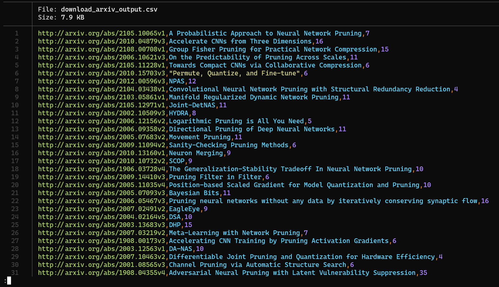

# Bulky downloader
**The script aims to automatically download most of the papers listed in Awesome Pruning.**

Since having local copies of papers, you can better organize your papers.
- One can directly have annotations on the files themselves.
- **Easy import to paper/citation management softwares**, i.e., [Zotero](https://www.zotero.org/)
  - You can directly drag all pdfs to zotero, and it will automatically extract the information of the file for your.
  - So, you don't need to click the links one by one.

## Usage
1. change variable `save_dir_path` *(line 8)* in `bulk_download_papers.py` to your preferred location.
2. `python download_papers.py`

## For Your Information
**It takes me about 20 minues to download all these files.**

Most of the papers comes from Arxiv (~100 papers), OpenAcess/Review (~20 papers), you can download with the help of the python script [download_papers.py](download_papers.py)
- it requires `paper_links.txt`
- it needs `arxiv` and `wget` libiraries.
  - please do `pip install arxiv wget` if you dont have them installed.

`download_papers.py` generates `download_arxiv_outputs.csv` which is intended to provide more information according to the download process
- it stores `url, title, time_consumed (in seconds)`
- here is a preview image, 

### Unselect Paper
Simply open `paper_link.txt` and either delete or comment out (with `#`) links.

The paper [Content-Aware GAN Compression](https://arxiv.org/abs/2104.02244) is **commented out by default*
- This file is huge.. Takes me about 3 minutes to download

### Orphan links
11 paper are not in download list
- https://proceedings.neurips.cc/paper/2020/hash/a914ecef9c12ffdb9bede64bb703d877-Abstract.html
- https://proceedings.mlr.press/v119/tan20a.html
- https://papers.nips.cc/paper/2020/file/703957b6dd9e3a7980e040bee50ded65-Paper.pdf
- https://ojs.aaai.org/index.php/AAAI/article/view/6058
- https://papers.nips.cc/paper/9521-autoprune-automatic-network-pruning-by-regularizing-auxiliary-parameters
- http://proceedings.mlr.press/v97/peng19c.html
- http://jankautz.com/publications/Importance4NNPruning_CVPR19.pdf
- https://papers.NeurIPS.cc/paper/7382-frequency-domain-dynamic-pruning-for-convolutional-neural-networks.pdf
- http://faculty.ucmerced.edu/mcarreira-perpinan/papers/cvpr18.pdf
- https://www.ijcai.org/proceedings/2018/0336.pdf
- https://papers.NeurIPS.cc/paper/6813-runtime-neural-pruning

**Please download mannually**
